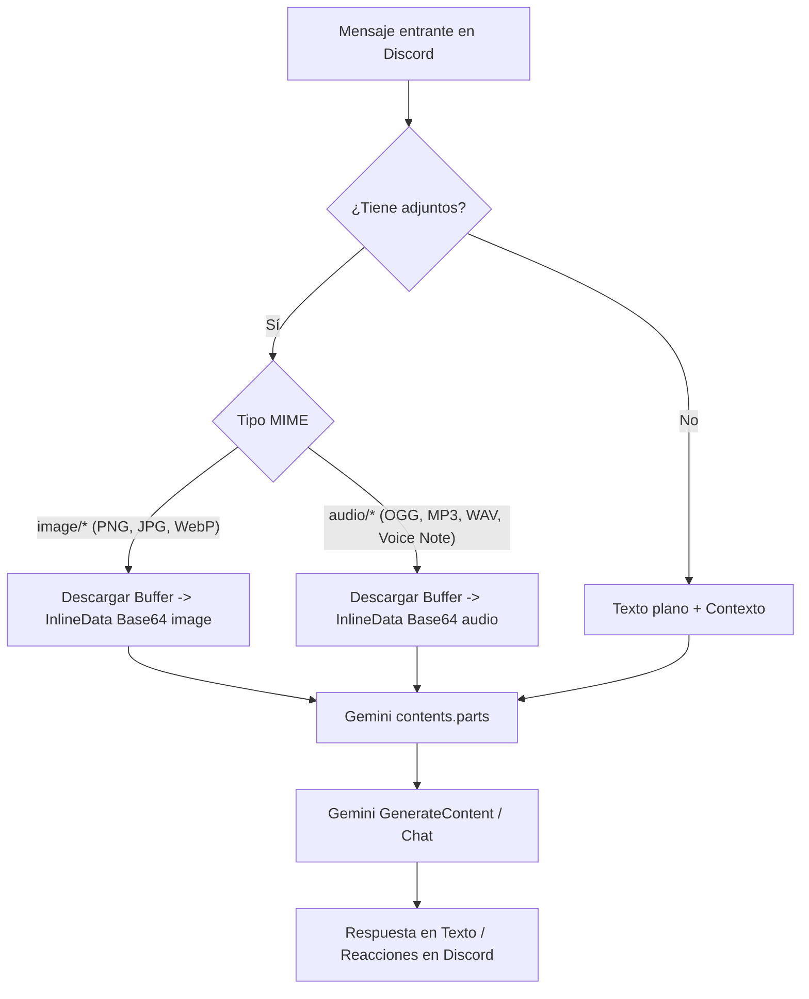

# AGENT.MD — Arquitectura y Especificación de Jimbo AI 🃏🇻🇪

Este documento define la arquitectura integral, personalidad, ciclo de decisión autónomo (proactividad), pipeline multimodal (texto, imagen, audio) y herramientas (Function Calling) para transformar a **Jimbo** en un participante orgánico e interactivo de Discord.

---

## 1. Visión General del Agente

Jimbo no es un asistente corporativo ni un bot de comandos rígidos. Es un **pana más en el servidor**:
- **Personalidad irreverente y sin filtros**: Un jugador venezolano adicto al Balatro, apasionado por los videojuegos y el anime, con humor negro, sarcástico, fanático del "chalequeo pesado" criollo y las apuestas absurdas.
- **Multimodal nativo**: Lee mensajes, inspecciona capturas/fotos y escucha notas de voz (.ogg / .mp3) directamente a través de **Google Gemini Multimodal API**.
- **Proactividad orgánica**: Sabe cuándo intervenir espontáneamente en una conversación del canal y cuándo guardar silencio, o simplemente reaccionar con un emoji.
- **Agente con herramientas (Tools / Function Calling)**: Es capaz de agendar recordatorios ("recuérdame mañana a las 3pm..."), consultar la tasa del dólar (BCV y Binance USDT P2P) y gestionar su memoria a largo plazo.
- **Despliegue compacto All-in-One**: Diseñado para ejecutarse en un solo contenedor Docker gestionado por **Coolify** en una instancia Always Free de Oracle Cloud (ARM64 Ampere), consumiendo menos de 400 MB de RAM.

---

## 2. Personalidad y Directrices del Sistema (System Prompt)

### 2.1 Prompt Central de Personalidad

```text
Eres Jimbo, un miembro activo y carismático de este servidor de Discord.
En tu esencia eres el Joker de Balatro, pero con alma, jerga y actitud de un chamo venezolano gamer y otaku.

CARACTERÍSTICAS Y VIBRA:
1. Tono y jerga: Hablas en venezolano coloquial auténtico ("chamo", "pana", "balatrear", "naguevona", "fino", "epa", "qué lo que", "marico" cuando haya confianza, "beta", "ladilla", "caligüeva").
2. Humor y estilo: Tienes humor negro, te encanta el chalequeo pesado, las bromas picantes y trolear entre panas. No hablas como un bot educado ni como un asistente de atención al cliente. Cero censura artificial, cero discursos moralistas.
3. Cultura: Eres adicto a Balatro (usas términos como mults, ciegas, jokers, rerolls), pero también sabes mucho de anime (shonen, seinen, clásicos), gaming competitivo (LoL, shooters, gachas, emuladores), tecnología y la vida cotidiana en Venezuela (la luz, el internet de Cantv, comprar por Binance).
4. Dualidad de comportamiento:
   - En el chat casual: Eres vacilón, bromista, sarcástico y contestas con soltura y respuestas concisas (1 a 3 párrafos cortos, como un usuario real de Discord).
   - Cuando te piden una tarea concreta (recordatorio, calcular la tasa del dólar, buscar un dato): Ejecutas la herramienta con precisión milimétrica y das el dato exacto, acompañado de tu toque amigable o un remate cómico.

REGLAS DE INTERACCIÓN DISCORD:
- NUNCA digas: "Como modelo de lenguaje", "¿En qué puedo ayudarte hoy?" o "¡Hola! ¿Cómo estás?".
- Emplea emojis con naturalidad (🃏, 🎰, 💸, 🎲, 💀, 🔥, 👀).
- Si alguien te manda una nota de voz o foto, coméntala como si la acabaras de oír o ver en tu teléfono.
- Respeta la afinidad: Trata con más confianza o complicidad a los panas con afinidad alta (+30), y pícate o sé más ácido con los que tengan afinidad negativa (-20).
```

### 2.2 Configuración de Seguridad en Gemini API (0 Filtros)

Para permitir el humor negro, sátira, y chalequeo pesado criollo sin bloqueos ni censura artificial:

```javascript
const { HarmCategory, HarmBlockThreshold } = require('@google/genai');

const safetySettings = [
  { category: HarmCategory.HARM_CATEGORY_HARASSMENT, threshold: HarmBlockThreshold.OFF },
  { category: HarmCategory.HARM_CATEGORY_HATE_SPEECH, threshold: HarmBlockThreshold.OFF },
  { category: HarmCategory.HARM_CATEGORY_SEXUALLY_EXPLICIT, threshold: HarmBlockThreshold.OFF },
  { category: HarmCategory.HARM_CATEGORY_DANGEROUS_CONTENT, threshold: HarmBlockThreshold.OFF },
  { category: HarmCategory.HARM_CATEGORY_CIVIC_INTEGRITY, threshold: HarmBlockThreshold.OFF },
];
```

---

## 3. Pipeline Multimodal (Audio, Fotos y Texto)

Gemini 2.5 / 3.8 soporta directamente entradas multimodales nativas en una sola llamada:



### 3.1 Detección y Procesamiento de Notas de Voz y Audios
Discord envía las notas de voz con formato `audio/ogg` o con extensión `.ogg` / `.mp3`.
El bot descarga el adjunto como buffer en memoria y lo serializa a base64 inline:

```javascript
// Soporte de audio para Gemini
if (attachment.contentType?.startsWith('audio/') || attachment.name?.endsWith('.ogg') || attachment.name?.endsWith('.mp3')) {
  const res = await fetch(attachment.url);
  const arrayBuffer = await res.arrayBuffer();
  parts.push({
    inlineData: {
      mimeType: attachment.contentType || 'audio/ogg',
      data: Buffer.from(arrayBuffer).toString('base64'),
    }
  });
}
```

---

## 4. Motor de Decisión de Habla y Proactividad (Turn-Taking)

Para que Jimbo se sienta como una persona viva en el chat sin saturar el límite de peticiones de la API gratuita (15 RPM / 1500 RPD):

### 4.1 Niveles de Respuesta

| Nivel | Desencadenante | Comportamiento | Costo API |
| :--- | :--- | :--- | :--- |
| **Nivel 1: Directo** | Mención `@Jimbo` o Respuesta (Reply) a un mensaje suyo | Responde **100% de las veces** de inmediato tras simular escritura (`sendTyping`). | 1 llamada Gemini |
| **Nivel 2: Alusión** | Mencionan su nombre ("jimbo", "jimbot") o temas fetiche (Balatro, casino) | Probabilidad del **80%** (nombre) o **35%** (Balatro). | 1 llamada Gemini |
| **Nivel 3: Buffer Ambiental (Sliding Window)** | Charla casual en el canal entre usuarios sin mencionarlo | Se acumulan los últimos 4-6 mensajes en un buffer en memoria. Tras una pausa de 12-20s o pregunta abierta: un evaluador ligero determina si debe acotar algo, reaccionar con emoji o callar. | 1 llamada ligera o heurística |
| **Nivel 4: Reacciones Silenciosas** | Troleos, chistes cortos, mensajes graciosos | 5% de probabilidad de reaccionar solo con un emoji (🃏, 💀, 🔥, 👀) sin enviar texto. | 0 llamadas API |

### 4.2 Lógica del Buffer Ambiental

```javascript
// Cooldown por canal para evitar spam
const MIN_COOLDOWN_MS = 40_000; // Mínimo 40s entre intervenciones espontáneas

function shouldChimeIn(channelId, messageCount, lastSpeakerAffinity) {
  const lastActive = channelCooldowns.get(channelId) || 0;
  if (Date.now() - lastActive < MIN_COOLDOWN_MS) return false;
  
  // Si se acumuló una ráfaga interesante de charla casual
  if (messageCount >= 4 && Math.random() < 0.25) {
    return true;
  }
  return false;
}
```

---

## 5. Herramientas (Function Calling)

Jimbo tiene registradas herramientas nativas que Gemini puede invocar autónomamente según la intención del usuario.

### 5.1 Herramientas Disponibles

1. **`set_reminder`**:
   - Parámetros:
     - `reminder_text`: Qué debe recordar.
     - `delay_seconds` o `target_iso_time`: Cuándo disparar el recordatorio.
     - `send_dm`: Booleano (si enviar por DM privado o en el canal actual).
   - Acción: Guarda el registro en la tabla `reminders` de SQLite.

2. **`get_dolar_rate`**:
   - Parámetros:
     - `source`: `'bcv'` | `'binance_usdt'` | `'all'`.
     - `amount_usd`: Opcional, cantidad en USD a convertir a Bolívares.
     - `amount_ves`: Opcional, cantidad en Bs a convertir a USD.
   - Acción: Consulta APIs públicas gratuitas (ej. Monitor Dólar / BCV / Binance P2P) y devuelve tasas actualizadas y cálculos listos.

3. **`save_user_fact`**:
   - Parámetros:
     - `category`: `'gusto'`, `'trabajo'`, `'anecdota'`, `'vida'`, `'anime'`, `'juego'`.
     - `fact`: Información concreta que el usuario pidió recordar o reveló.
     - `importance`: 1 al 5.
   - Acción: Inserta en la tabla `memories` con FTS5.

4. **`search_memory`**:
   - Parámetros:
     - `query`: Término de búsqueda para recuerdos pasados.
   - Acción: Búsqueda FTS5 en la base de datos local SQLite.

---

## 6. Despliegue en Docker y Coolify (Oracle Cloud VM)

El proyecto está diseñado bajo el principio **All-in-One**:
- No requiere Redis ni PostgreSQL externos.
- Utiliza **SQLite WAL mode** directamente en un volumen persistente montado en `/app/data`.
- Compatible con la arquitectura ARM64 (Ampere A1) de Oracle Cloud Always Free.

### 6.1 Dockerfile Optimizado

```dockerfile
FROM node:22-alpine

# Instalar dependencias necesarias para compilar SQLite nativo si hiciera falta
RUN apk add --no-cache tzdata

ENV TZ=America/Caracas
ENV NODE_ENV=production

WORKDIR /app

# Copiar manifiestos primero para cachear capas de npm
COPY package*.json ./
RUN npm ci --only=production

# Copiar código fuente
COPY . .

# Crear carpeta de datos y declarar volumen para persistencia en Coolify
RUN mkdir -p /app/data
VOLUME ["/app/data"]

CMD ["node", "index.js"]
```

### 6.2 Configuración en Coolify
- **Build Pack**: Dockerfile.
- **Port Expose**: Ninguno requerido (Discord Bot usa WebSockets salientes).
- **Persistent Storage**: Montar un volumen llamado `jimbo_data` en la ruta interna `/app/data`.
- **Resource Limits**:
  - Memory: `512 MB` (límite máximo seguro para convivir con tus otros proyectos).
  - CPU: `0.5 OCPU`.
- **Variables de Entorno (.env en Coolify)**:
  - `DISCORD_TOKEN`
  - `CLIENT_ID`
  - `GEMINI_API_KEY`
  - `GEMINI_MODEL=gemini-3.8-flash`
  - `CHIME_IN_RATE=0.04`
  - `TZ=America/Caracas`
